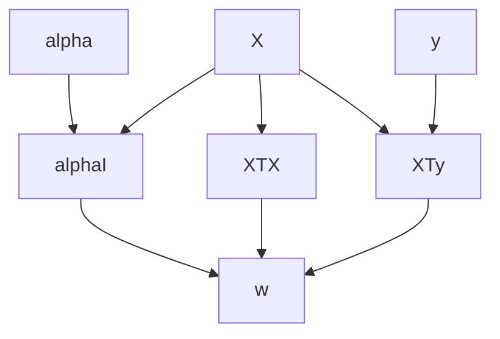

# tweakML

A python library for defining machine learning and statistical models, which builds a dependency graph and uses smart caching under the hood to allow for input parameters to be efficiently tweaked.

## Motivation

Many machine learning and statistical models can be understood as a pipeline that map input variables and hyperparameters to an output prediction or solution. But what happens when one or more of these variables is changed? This is situation is common when, for example, searching for the optimum hyperparameter value over a validation set or testing the solution's robustness to noise in the input data. The simplest solution is to recompute the whole model from scratch, however, this can be computationally expensive for large datasets or complex models. Often, much of the computational work can be cached, meaning it is only necessary to recompute a small part of the model, which can bring large computational savings. TweakML is designed to automatically build a model dependency graph, such that when one input  parameter is changed, only the necessary parts of the model are recomputed.

## Example: Ridge Regression

Consider the example of ridge regression. Let's say we have a feature matrix $\mathbf{X} \in 
\mathbb{R}^{N \times M}$ and an observed target vector $\mathbf{y} \in \mathbb{R}^{N}$. In addition, we 
have a  parameter $\alpha$ which provides regularisation. The optimum coefficient vector $\mathbf
{w} \in \mathbb{R}^{M}$, which we write as a function of $\alpha$, is given by 

$$\mathbf{w}(\alpha) = \left( \mathbf{X}^\top \mathbf{X} + \alpha \mathbf{I}\right)^{-1} \mathbf{X}^\top 
\mathbf{y}$$

The predicted output, $\bar{\mathbf{y}}$, on a validation set $\bar{\mathbf{X}}$ would then by given 

$$\bar{\mathbf{y}} = \bar{\mathbf{X}} \mathbf{w}(\alpha)$$

We could build a simple model for this as follows 

```python 
import numpy as np

class RidgeRegression:
    
    def __init__(self, X, y, alpha):
        self.X = X
        self.y = y
        self.alpha = alpha
        
    def w(self):
        return np.linalg.solve(self.X.T @ self.X + self.alpha * np.eye(self.X.shape[1]), self.X.T @ self.y)
    
    def predict(self, X_):
        return X_ @ self.w()
```

Checking the prediction error over a validation set might look something like this:

```python 
from sklearn.model_selection import train_test_split

N = 100
M = 5
X_all = np.random.randn(N, M)
y_all = np.random.randn(N)

X, X_, y, y_ = train_test_split(X_all, y_all, test_size=0.3)

model = RidgeRegression(X, y, 0.1)

err = []
for alpha in np.linspace(0.01, 1, 50):
    model.alpha = alpha
	err.append(((model.predict(X_) - y_) ** 2).sum())    

```

The problem here is that, when we change the value of `alpha`, we need to recompute the value of `w` from scratch. 

To solve this problem, first let's break the computation of `w`  up into steps. 

```python 
class RidgeRegression:
    
    def __init__(self, X, y, alpha):
        self.X = X
        self.y = y
        self.alpha = alpha
        
    def XTX(self):
        return self.X.T @ self.X
    
    def XTy(self):
        return self.X.T @ self.y
    
    def alphaI(self):
        return self.alpha * np.eye(self.X.shape[1])
        
    def w(self):
        return np.linalg.solve(self.XTX() + self.alphaI(), self.XTy())
    
    def predict(self, X_):
        return X_ @ self.w()
```

In this way, the computation of `w` can be visualised as a dependency graph. 



Note that, if `alpha` is changed, there is no need to recompute `XTX` or `XTy`. Only the nodes downstream of `alpha`, i.e. `alphaI`, and `w` and need to be recomputed. TweakML handles this automatically as follows: 

```python
from tweakml import Model, node, Tweakale

class RidgeRegression(Model):
    
    X = Tweakable()
    y = Tweakable()
    alpha = Tweakable()
    
    def __init__(self, X, y, alpha):
        super().__init__()
        self.X = X
        self.y = y
        self.alpha = alpha
    
    @node    
    def XTX(self):
        return self.X.T @ self.X
    
    @node
    def XTy(self):
        return self.X.T @ self.y
    
    @node
    def alphaI(self):
        return self.alpha * np.eye(self.X.shape[1])
	
    @node
    def w(self):
        return np.linalg.solve(self.XTX() + self.alphaI(), self.XTy())
    
    def predict(self, X_):
        return X_ @ self.w()
```

As visible, there are three key steps to making a tweakML model: 

1. Make the model inherit from the `Model` class and call `super().__init__()`. 
2. Define the tweakable parameters at the class level, and set their initial values in the `__init__` method. 
3. Define each step in the computation by writing a method and decorating it with the `node` decorator. 

Now when we run the following code, the intermediate steps in the computation graph are cached. Every time we reset `alpha`, only the nodes downstream are unchached, meaning the model can be recomputed in the most efficient way possible. 

```python 
model = RidgeRegression(X, y, 0.1)

err = []
for alpha in np.linspace(0.01, 1, 50):
    model.alpha = alpha
	err.append(((model.predict(X_) - y_) ** 2).sum()) 
```

