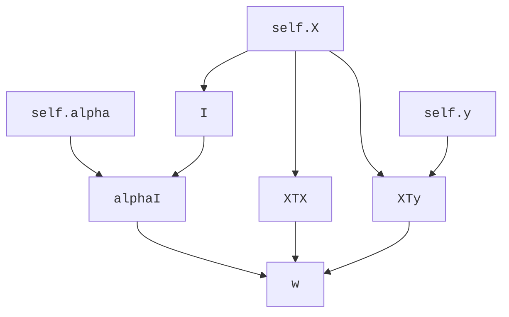

# tweakML

TweakML is a python library for building custom machine learning, statistical and general 
mathematical models. Models of this nature can often be understood as a large 
function mapping inputs (data, hyperparameters etc.) to outputs (weights, predictions, error 
scores etc.). A common task is to change one or more the inputs to see 
the effect on the output. This often requires running the whole model from scratch or 
complex accounting to keep track of which parts of the model need recomputing and which don't. 

TweakML aims to overcome this issue by automatically keeping track of the internal model 
dependencies. Under the hood, the model gets described by a directed acyclic graph, with each 
node represents an intermediate calculation that is cached after running for the first time. 
Then, when one or more of the inputs is changed, only nodes downstream of the change are marked 
for recomputation. This can bring large savings in terms of computational workload. 

## Installation 

For now install manually by navigating into the `tweakML` directory and running 

```
pip install .
```


## Example: Ridge Regression

Consider the example of ridge regression where we have a feature matrix $\mathbf{X} \in 
\mathbb{R}^{N \times M}$ and an observed target vector $\mathbf{y} \in \mathbb{R}^{N}$. In addition, we 
have a  parameter $\alpha$ which provides regularisation. The coefficient vector $\mathbf
{w} \in \mathbb{R}^{M}$ is given by 

$$\mathbf{w} = \left( \mathbf{X}^\top \mathbf{X} + \alpha \mathbf{I}\right)^{-1} \mathbf{X}^\top 
\mathbf{y}$$

The predicted output, $\mathbf{y}'$, on a validation set $\mathbf{X}'$ would in turn be given 

$$\mathbf{y}' = \mathbf{X}' \mathbf{w}$$

A python implementation of this might look something like this. 

```python 
import numpy as np

class RidgeRegression:
    
    def __init__(self, X, y, alpha):
        self.X = X
        self.y = y
        self.alpha = alpha
        
    def w(self):
        XTX = self.X.T @ self.X 
        XTy = self.X.T @ self.y
        I = np.eye(self.X.shape[1]) 
        alphaI = self.alpha * I
        w = np.linalg.solve(XTX + alphaI, XTy)
        return w
    
    def predict(self, X_):
        return X_ @ self.w()
```

Note how the computation of `w` can be visualised as a dependency graph. 



If `self.alpha` is changed, there is no need to recompute `I`, `XTX` or `XTy`. Similarly, 
changing `self.y` means only `XTy` and `w` need recomputing. Only changes to `self.X` require 
the full model to be run again. 

# Building a tweakML Model

TweakML can be used to automatically build this dependency graph. Simply label the input 
variables and mark each step in the computational process. 

```python
from tweakml import Model, node, Tweakable

class RidgeRegression(Model):
    
    X = Tweakable()
    y = Tweakable()
    alpha = Tweakable()
    
    def __init__(self, X, y, alpha):
        super().__init__()
        self.X = X
        self.y = y
        self.alpha = alpha
    
    @node    
    def XTX(self):
        return self.X.T @ self.X
    
    @node
    def XTy(self):
        return self.X.T @ self.y
    
    @node 
    def I(self):
        return np.eye(self.X.shape[1])
    
    @node
    def alphaI(self):
        return self.alpha * self.I()
	
    @node
    def w(self):
        return np.linalg.solve(self.XTX() + self.alphaI(), self.XTy())
    
    def predict(self, X_):
        return X_ @ self.w()

    def error(self, X_, y_):
        return ((self.predict(X_) - y_) ** 2).sum()
```

As visible, there are three key steps to making a tweakML model: 

1. Make the model inherit from the `Model` class and call `super().__init__()`. 
2. Define the tweakable parameters at the class level, and set their initial values in the `__init__` method. 
3. Define each step in the computation by writing a method and decorating it with the `node` decorator. 

Now when we run the following code, the intermediate steps in the computation graph are cached. Every time we reset `alpha`, only the nodes downstream are unchached, meaning the model can be recomputed in the most efficient way possible. 

```python 
model = RidgeRegression(X, y, 0.1)

err = []
for alpha in np.linspace(0.01, 1, 50):
    # reset alpha - everything downstream automatically uncached
    model.alpha = alpha
    err.append(model.error(X_, y_)) 
```

